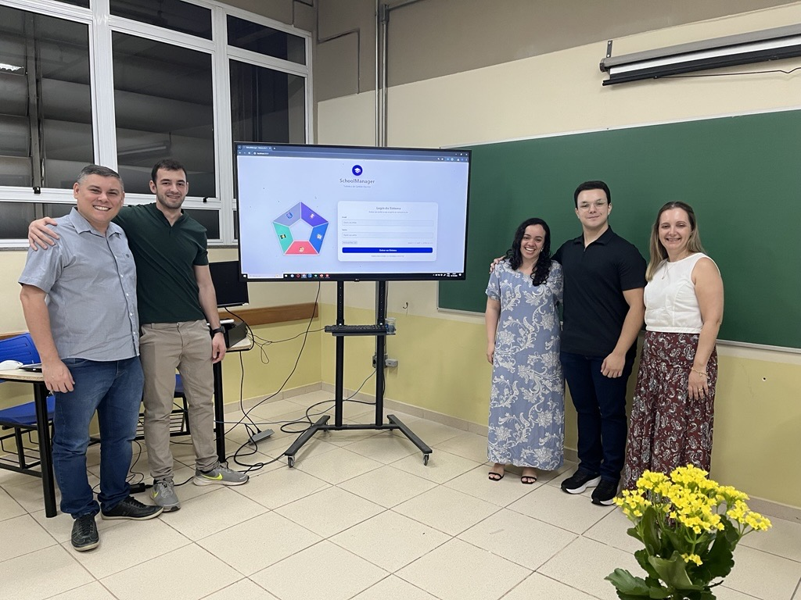

# SchoolManager

**Demonstração online:** [schoolmanager-demo.onrender.com](https://schoolmanager-demo.onrender.com). O serviço gratuito pode levar cerca de um minuto para abrir após um período sem acessos. Os dados cadastrados nessa demonstração voltam à base inicial quando o serviço reinicia; não use a demonstração para guardar dados reais.

**Android:** [baixar APK de demonstração](https://github.com/Tharsonts/SchoolManager/releases/download/v1.0.2-demo/SchoolManager-Demo.apk). O aplicativo abre a demonstração online e precisa de internet.

<p align="center">
  <strong>Plataforma completa de gestão escolar desenvolvida como Trabalho de Conclusão de Curso.</strong>
</p>

<p align="center">
  
  
  
  
  
</p>

## Sobre o projeto

O **SchoolManager** nasceu como Trabalho de Conclusão de Curso apresentado na **Fatec Presidente Prudente**. A ideia surgiu a partir da experiência dos integrantes com sistemas acadêmicos que apresentavam navegação pouco intuitiva, processos fragmentados e tarefas administrativas demoradas.

Com base nesse problema real, o grupo decidiu projetar uma alternativa mais clara, integrada e moderna. O resultado foi uma plataforma que conecta os principais participantes de uma instituição de ensino — administrador, diretor, coordenador, professor e aluno — em um único ambiente.

Mais do que uma interface conceitual, o projeto evoluiu para um sistema funcional com autenticação por perfil, gestão acadêmica, comunicação interna, lançamento de notas e frequência, geração de boletins e um assistente pedagógico executado localmente no navegador.

## Apresentação do TCC

<p align="center">
  
</p>

<p align="center"><em>Registro da apresentação do SchoolManager na Fatec Presidente Prudente.</em></p>

## Principais recursos

- Cinco áreas de acesso com menus e permissões específicas.
- Administração de alunos, professores, coordenadores, diretores e administradores.
- Cadastro de turmas, disciplinas e períodos acadêmicos.
- Materiais didáticos, atividades e provas.
- Lançamento de notas e controle de frequência.
- Boletins individuais ou por turma, com filtros e exportação em PDF.
- Chat interno, calendário e notificações.
- Logs administrativos e acompanhamento das operações do sistema.
- Assistente pedagógico local para planejamento de aulas, atividades e explicações.
- Perfil com foto e recuperação demonstrativa de senha.
- Interface responsiva para computadores, tablets e celulares.

## Assistente pedagógico e privacidade

O assistente utiliza WebLLM e é processado diretamente no dispositivo do visitante. Não existe chave de API no repositório e as conversas não são enviadas para uma API externa.

Em computadores, no primeiro uso o navegador baixa o modelo local. Essa funcionalidade exige um navegador recente com WebGPU e pode consumir alguns gigabytes de armazenamento. Chrome e Edge são as opções recomendadas. Em celulares, o assistente permanece visível, mas o download e o uso do modelo estão desativados.

## Acessos de demonstração

Todos os perfis utilizam a senha `123`:

| Perfil | E-mail |
| --- | --- |
| Administrador | `admin@escola.com` |
| Diretor | `diretor@escola.com` |
| Coordenador | `coordenador@escola.com` |
| Professor | `professor@escola.com` |
| Aluno | `aluno@escola.com` |

> Essas credenciais e os dados presentes no repositório são exclusivamente demonstrativos.

## Tecnologias

### Frontend

- React, TypeScript e Vite
- Tailwind CSS e componentes Radix UI
- TanStack Query, Socket.IO e Recharts
- jsPDF para geração dos boletins
- WebLLM para o assistente local

### Backend

- Node.js e Express
- SQLite, libSQL e Drizzle ORM
- Passport e sessões autenticadas
- Socket.IO para recursos em tempo real

## Executando localmente

Requisitos: Node.js 20 ou superior e npm.

```bash
git clone https://github.com/Tharsonts/SchoolManager.git
cd SchoolManager
npm install
copy .env.example .env
npm run dev
```

Acesse [http://localhost:3001](http://localhost:3001).

Em Linux ou macOS, substitua `copy` por:

```bash
cp .env.example .env
```

### Produção

```bash
npm run build
npm start
```

O projeto contém um banco demonstrativo sanitizado. Em uma instalação nova ele é copiado automaticamente, disponibilizando os cinco acessos padrão sem expor mensagens, contatos ou dados pessoais utilizados durante o desenvolvimento.

## Implantação

O GitHub Pages não executa o backend Express nem o banco SQLite. Por isso, o repositório inclui um `render.yaml`, que descreve a aplicação para uma hospedagem compatível com Render Blueprint.

Em serviços com armazenamento efêmero, alterações realizadas durante a demonstração podem ser reiniciadas quando uma nova instância for criada. Para um portfólio público, esse comportamento ajuda a manter os dados de exemplo limpos.

## Segurança

- Arquivos `.env`, bancos locais, uploads e logs não são publicados.
- O banco incluído no repositório contém somente dados demonstrativos sanitizados.
- Senhas são armazenadas como hash.
- Códigos temporários possuem expiração e limite de tentativas.
- O modelo de IA funciona sem chave de API externa.
- Dados pessoais de estudantes não devem ser enviados ao assistente.

## Contexto acadêmico

Projeto desenvolvido para fins acadêmicos e de portfólio como TCC da **Faculdade de Tecnologia de Presidente Prudente (Fatec Presidente Prudente)**. O SchoolManager demonstra a aplicação prática de engenharia de software na análise de um problema, modelagem de diferentes perfis de usuário e construção de uma solução web integrada.

## Licença

Distribuído sob a licença MIT.
